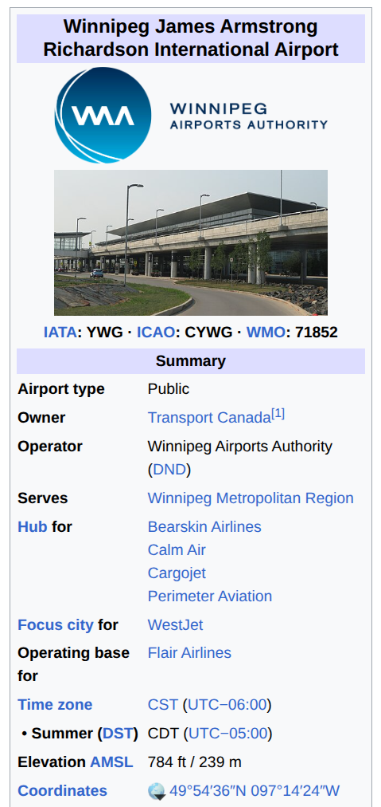
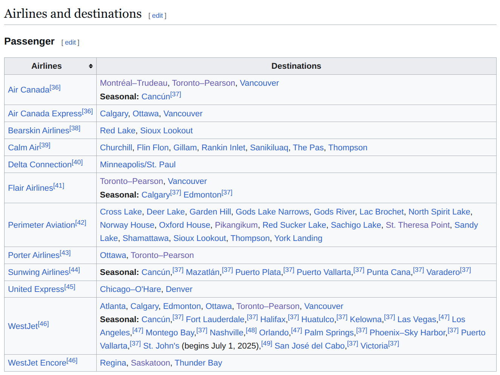

# Summary

The global air transportation network plays a crucial role in a wide variety of human activities and, consequently, in the many areas of research related to these activities, from geography to sociology, epidemiology, transport, etc.
This package scrapes Wikipedia data to build a snapshot of the architecture of the global air transportation network.

# Statement of need

`wikipediaGATN` is a Python package for deriving the structure of the global air transportation network (GATN) from information publicly available on Wikipedia.

Many commercial entities (IATA, OAG, etc.) have comprehensive datasets detailing the structure and utilisation of the GATN.
However, these datasets can be prohibitively priced for researchers.
`wikipediaGATN` seeks to provide middle ground: while not providing any information as to flight volumes, it mines the wikipedia API to infer the structure of the GATN from information on airports available on Wikipedia.

An earlier version of `wikipediaGATN` was used by the authors and collaborators during the early stages of the COVID-19 pandemic, when Arino was working under contract with the Public Health Agency of Canada to create daily summaries of the likely next ISO-3166-1 level places to report cases of COVID-19. 
It was used in the preparation of (confidential) report [@Pearson:2017] and is being used in a scientific publication under preparation on the subject. 
It will also be used in Arino's Mathematics of Data Science course, where techniques of social network analysis are being presented.
There is no doubt that other researchers working on topics touching on the GATN will benefit from the package.
This will also be of interest to instructors teaching graph or network theory.

# Methods

Airport information pages on Wikipedia have evolved to become quite standardised entities.
There is, typically, an infobox that presents summary information about the airport (name, IATA and ICAO codes, city served, geographical coordinates); see, for example, the infobox for YWG, the Winnipeg James Armstrong International Airport in \autoref{fig:infobox}.

Most airport pages also contain a table detailing airlines operating out of the airport and the destinations they serve (\autoref{fig:airlines}).

This homogeneisation of resources means that it is reasonably easy to use web scraping tools to gather information.

# Citations

Citations to entries in paper.bib should be in
[rMarkdown](http://rmarkdown.rstudio.com/authoring_bibliographies_and_citations.html)
format.

If you want to cite a software repository URL (e.g. something on GitHub without a preferred
citation) then you can do it with the example BibTeX entry below for @fidgit.

For a quick reference, the following citation commands can be used:
- `@author:2001`  ->  "Author et al. (2001)"
- `[@author:2001]` -> "(Author et al., 2001)"
- `[@author1:2001; @author2:2001]` -> "(Author1 et al., 2001; Author2 et al., 2002)"

# Acknowledgements

We acknowledge discussions with Stephanie Portet. JA acknowledges years of fruitful collaboration with Kamran Khan, CEO of Bluedot.global, through whom he had access to much more extensive data.

# References